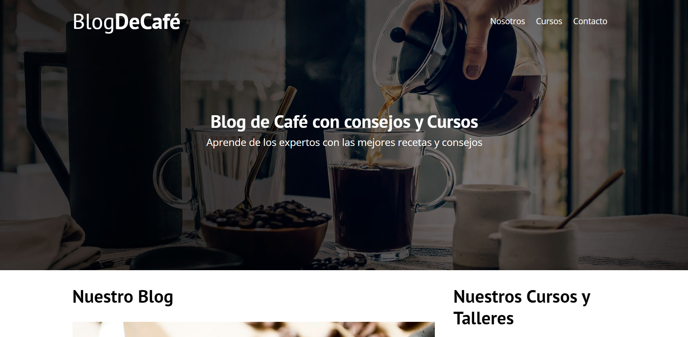
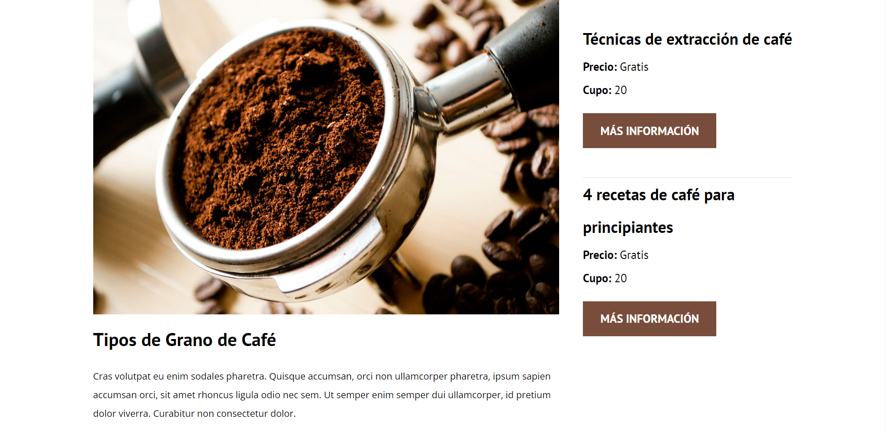
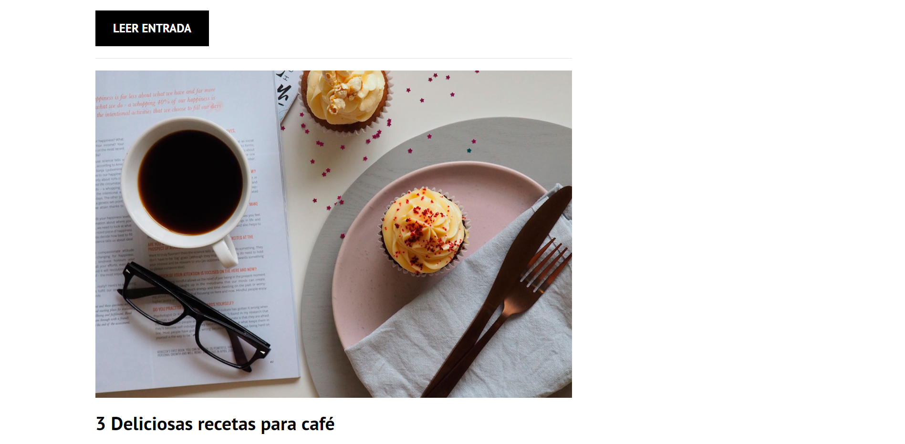
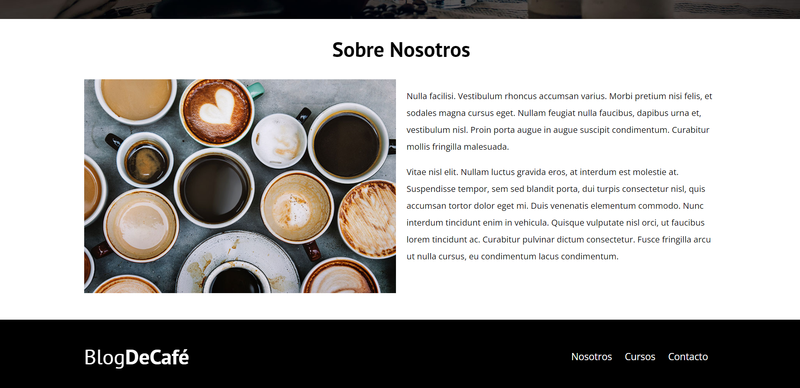
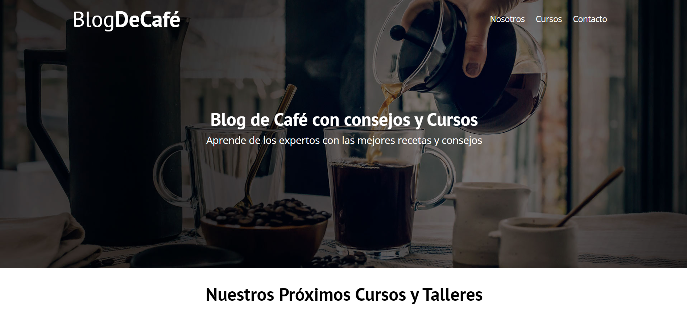
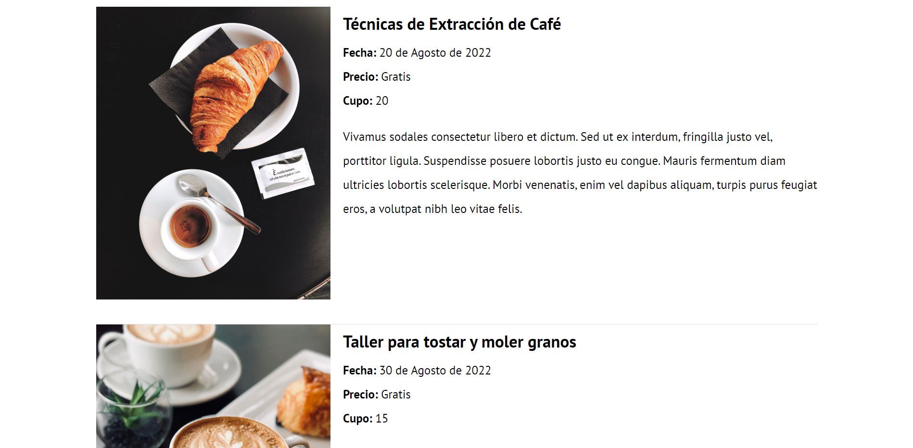
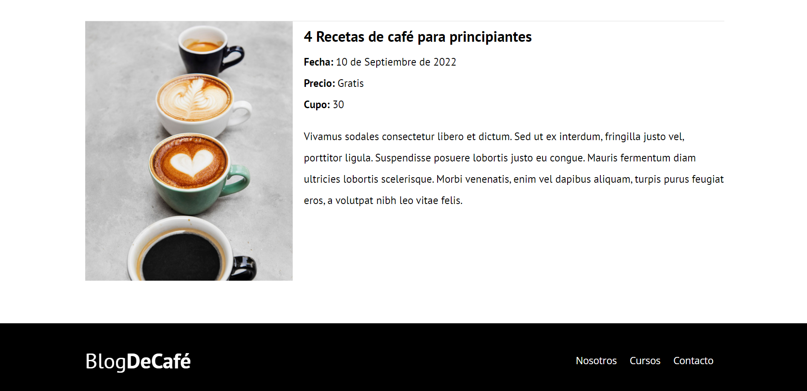
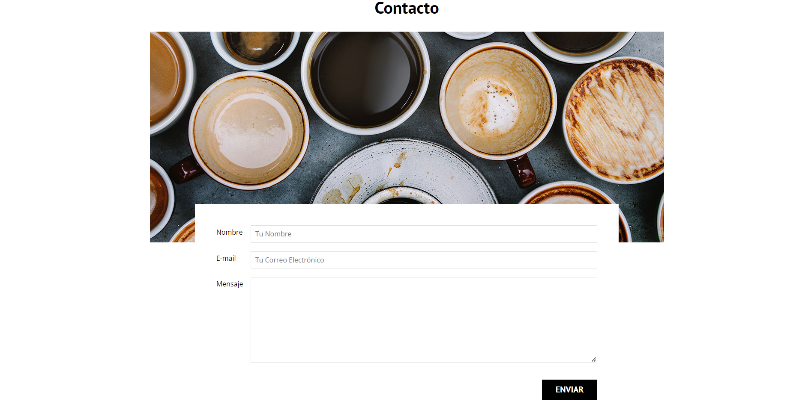

# Blog de café (consejos y cursos)

## Capturas de pantalla:

### Primera parte de la página web:

### Cursos y talleres:

### Blog:

### Sección nosotros:

### Sección cursos:

### Sección contacto:

## Funcionamiento

## Tecnologías
- HTML
- CSS

Además, se incluyeron **Google Fonts** para personalizar la fuente y **Flaticon** para incorporar iconos.
